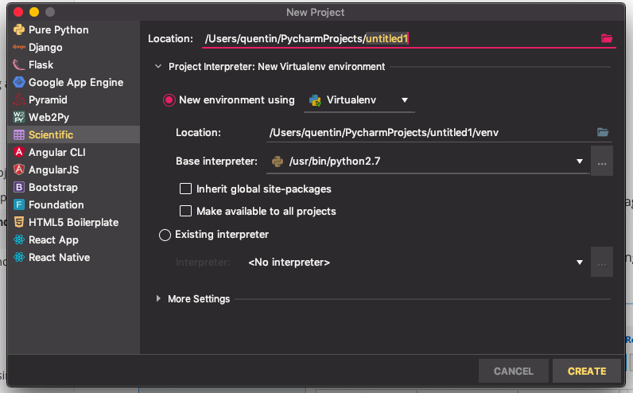
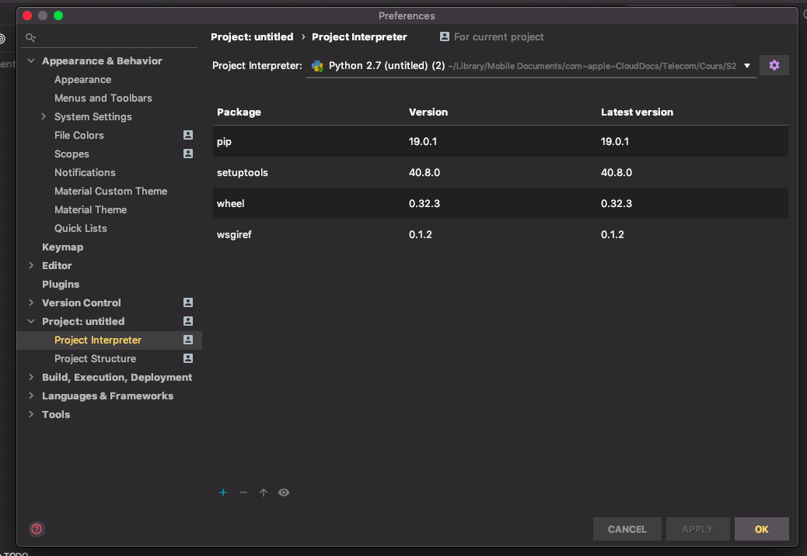

# Installation de matplotlib sur PyCharm

* Creation d'un nouveau projet "Python pur". Il faut ensuite dérouler la section "Project Interpreter" en utilisant une environnement virtuel 'venv' à la place de **Conda**  

* Aller dans paramètres -> Project : *Nom du projet* -> Project Interpreter, cliquer sur le + en bas de la fnêtre et recherhcher dans la barre de recherche en haut "matplotlib" puis cliquer sur install package (Il en est de même pour "numpy")  

  

* Si message "Directory not foud" lors de l'execution, il faut cliquer sur le nom du projet a gauche puis dans la section "Edits Configurations ...". Ensuite if cliquer sur le dossier au bout de "Script Path" puis cliquer sur le "main.py" et là, le programme devrait s'executer
